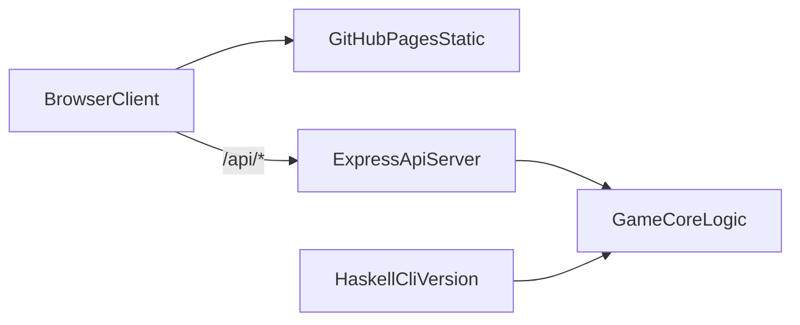
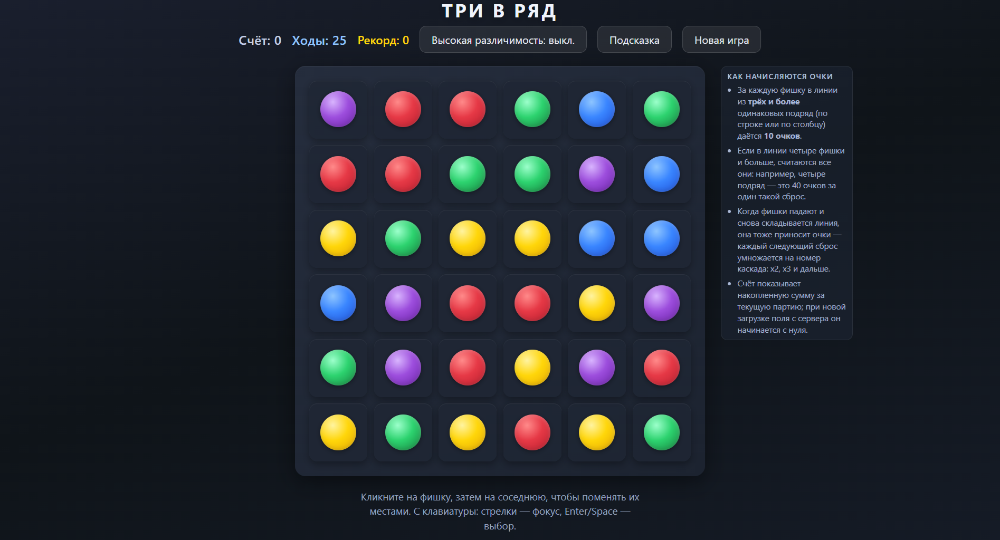

# Tree in a row


Live Demo: [https://dimkarogov.github.io/Three-in-a-row/](https://dimkarogov.github.io/Three-in-a-row/)

> [!NOTE]
> Backend развернут на Render `Free plan`, поэтому после простоя возможен cold start.
> Если игра не загрузилась сразу, подождите примерно `30-60 секунд` и обновите страницу.

Проект с игрой "Три в ряд", доступной в двух версиях: консольной (Haskell) и браузерной (SPA + REST API на TypeScript/Express).

## Содержание

- [Геймплей](#геймплей)
- [Архитектура](#архитектура)
- [Tech Stack](#tech-stack)
- [Скриншоты](#скриншоты)
- [Консольная версия (Haskell)](#консольная-версия-haskell)
- [Сервер (TypeScript + Express)](#сервер-typescript--express)
- [Браузерная версия (HTML/CSS/JS)](#браузерная-версия-htmlcssjs)
- [Docker](#docker)
- [Deploy](#deploy)
- [CI](#ci)
- [Структура проекта](#структура-проекта)
- [Contributing](#contributing)
- [License](#license)

## Геймплей

- Браузерное поле `6x6`, пять типов фишек со значениями `1`, `2`, `3`, `4`, `5`.
- Чтобы сделать ход, нужно поменять местами две **соседние** клетки (по горизонтали или вертикали).
- Если после обмена не образуется ряд из трёх и более одинаковых фишек, ход откатывается.
- Совпавшие фишки удаляются, оставшиеся падают вниз, сверху появляются новые. Если возникают новые совпадения — запускается каскад с возрастающим множителем очков.
- Игра завершается, когда не остаётся ни одного хода, создающего совпадение. Лучший результат сохраняется в `localStorage` браузера.

### Управление (браузерная версия)

- Клик по клетке выделяет её, клик по соседней — выполняет обмен.
- Повторный клик по той же клетке снимает выделение.
- Клавиатура: стрелки (`←`, `↑`, `→`, `↓`) перемещают фокус, `Enter` / `Space` выделяют клетку и подтверждают обмен.
- Кнопка **«Новая игра»** сбрасывает поле (с подтверждением, если партия уже началась).
- Кнопка **«Подсказка»** подсвечивает пару клеток с гарантированно валидным обменом (подсказка приходит с сервера).
- Кнопка **«Высокий контраст»** включает режим повышенной контрастности с дополнительными формами на фишках; настройка сохраняется в `localStorage`.
- Счётчик **«Ходы»** показывает, сколько результативных ходов осталось до конца партии; при ≤ 5 ходах счётчик подсвечивается.

### Доступность

- Поле размечено ARIA-атрибутами (`role="grid"`, `gridcell`, `aria-rowindex`/`aria-colindex`, `aria-selected`) с русскоязычными подписями для скринридеров.
- Счёт, оставшиеся ходы и системные сообщения выводятся в `aria-live` регионы.
- Анимации уважают системную настройку `prefers-reduced-motion`.

## Архитектура



Игровая логика в браузерной версии живёт на сервере: клиент только отправляет ходы и анимирует ответы.

## Tech Stack

- Frontend: `HTML`, `CSS`, `Vanilla JavaScript` (без фреймворков)
- Backend: `Node.js` (>=20), `Express 5`, `TypeScript`
- Tests: `Vitest`
- Lint/Format: `ESLint`, `Prettier`
- CI/CD: `GitHub Actions`, `GitHub Pages`, `Render`
- CLI version: `Haskell` + `Cabal`
- Контейнеризация: `Docker` (multi-stage, Node 22 Alpine)

## Скриншоты



## Консольная версия (Haskell)

### Возможности

- Поле `6x6` с числами от `1` до `3`
- Обмен только соседних элементов
- Поиск горизонтальных и вертикальных троек
- Удаление совпадений и генерация новых элементов
- Подсчёт очков (`10` за каждую убранную фишку)
- Ввод хода — четыре числа через пробел (`row1 col1 row2 col2`, индексация с 1)
- Выход из игры по команде `q`

### Требования

- [GHC](https://www.haskell.org/ghc/)
- [Cabal](https://www.haskell.org/cabal/)

### Запуск

```bash
cabal run tree-in-a-row
```

или

```bash
cabal build
cabal exec tree-in-a-row
```

## Сервер (TypeScript + Express)

### Установка и запуск

```bash
cd server
npm ci
npm run dev
```

Сервер слушает `http://localhost:3000`. Порт можно переопределить через переменную окружения `PORT`.

### NPM-скрипты

| Скрипт | Описание |
|--------|----------|
| `npm run dev` | Запуск dev-сервера через `ts-node` |
| `npm run build` | Компиляция TypeScript в `dist/` |
| `npm test` | Юнит- и интеграционные тесты на `Vitest` (`supertest` для роутов) |
| `npm run lint` | Проверка `ESLint` |
| `npm run format` | Форматирование через `Prettier` |
| `npm run format:check` | Проверка форматирования без изменения файлов |

> Production-запуск: `npm run build && node dist/index.js` (отдельного `npm start` нет).

### API

| Метод | Путь | Описание |
|-------|------|----------|
| `GET` | `/api/health` | Проверить доступность backend |
| `POST` | `/api/new-game` | Создать новое поле и сбросить счёт |
| `GET` | `/api/board` | Получить текущее поле и счёт |
| `POST` | `/api/move` | Выполнить ход `{ row1, col1, row2, col2 }` |
| `GET` | `/api/score` | Получить текущий счёт |

Ответ `/api/move` содержит:
- `board` — финальное состояние поля
- `score` — обновлённый счёт
- `movesLeft` — сколько результативных ходов осталось
- `reverted: true` — если обмен не дал совпадений и был откатан
- `gameOver: true` — если ходы закончились или возможных ходов не осталось
- `hint` — координаты следующего гарантированно валидного обмена (или `null`, если ходов больше нет)
- `animation` — данные для проигрывания анимации на клиенте:
  - `boardAfterSwap` — состояние поля сразу после обмена (до удаления троек)
  - `rounds[]` — массив каскадов, каждый раунд содержит `matched` (координаты совпавших клеток), `boardAfter`, `multiplier` и `roundScore`

Запросы `GET /api/board` и `POST /api/new-game` возвращают объект со схемой `{ board, score, movesLeft, gameOver, hint }`.

Очки за ход считаются по каскадам: первый сброс даёт `10` очков за каждую убранную фишку, второй умножается на `2`, третий на `3` и так далее. После наступления `gameOver` повторный ход вернёт `409 Conflict`.

Known limitation: один экземпляр backend хранит партию в памяти процесса, поэтому разные вкладки или игроки сейчас разделяют одно состояние игры. Это поведение покрыто route-тестом и будет пересмотрено при появлении мультиплеера или leaderboard.

## Браузерная версия (HTML/CSS/JS)

1. Запустите backend (`npm run dev` в `server/`).
2. Откройте `index.html` в браузере (можно через любой статический сервер или напрямую как файл).

По умолчанию при `localhost`/`127.0.0.1` фронт автоматически использует `http://localhost:3000`.

Для прод-режима endpoint задаётся через `config.prod.js`:

```js
// Замените your-backend-url на URL вашего API
window.__API_BASE__ = "https://your-backend-url.onrender.com"
```

Лучший результат хранится в `localStorage` под ключом `tree-in-a-row:bestScore:v1`, режим высокой контрастности — под ключом `tree-in-a-row:highContrast:v1`.

Клиент использует `fetch` с `AbortController` и таймаутом `60` секунд; при ошибках/таймаутах в баннере `#api-status` появляется сообщение и кнопка **«Повторить»** (например, при холодном старте Render Free).

## Docker

Сборка контейнера:

```bash
docker build -t tree-in-a-row-api ./server
```

Запуск:

```bash
docker run --rm -p 3000:3000 tree-in-a-row-api
```

Проверка:

```bash
curl http://localhost:3000/
```

## Deploy

### Frontend (GitHub Pages)

- Workflow: `.github/workflows/deploy-pages.yml`
- **Обязательно** задайте `BACKEND_API_BASE`: **Settings → Secrets and variables → Actions** — либо *Secret*, либо *Variable* (второе удобно, URL не секрет) со значением корня API, например `https://ваш-сервис.onrender.com` (без `/` в конце, без пути).
- Сборка **упадёт** без этой настройки — иначе страница на `github.io` пытается обратиться не к Render, и в игре пустое поле / ошибка загрузки.
- После push в `main` статика деплоится автоматически; при смене URL сделайте re-run workflow «Deploy Pages».

### Backend (Render)

В репозитории есть `render.yaml` — можно подключить как Blueprint.

Вариант через UI Render:
1. **New Web Service** → подключить репозиторий
2. **Root Directory**: `server`
3. **Build Command**: `npm ci && npm run build`
4. **Start Command**: `node dist/index.js`
5. **Environment**: Node `22`

## CI

Workflow `.github/workflows/ci.yml` запускается на push в `main` и pull request:

- backend `lint` / `format:check` / `build` / `test` на матрице Node `20` и `22`
- haskell smoke build (`cabal build`) на GHC `9.6`

## Структура проекта

```
.
├── main.hs                  # Консольная версия на Haskell
├── tree-in-a-row.cabal      # Конфигурация Cabal-проекта
├── index.html               # Браузерный клиент
├── style.css
├── game.js
├── config.prod.js           # API endpoint для production
├── server/                  # Backend на Node.js + TypeScript
│   ├── src/index.ts         # Точка входа Express
│   ├── src/routes.ts        # REST-маршруты, состояние игры
│   ├── src/game.ts          # Игровая логика (поле, гравитация, очки)
│   ├── src/types.ts         # Общие типы API
│   ├── src/game.test.ts     # Юнит-тесты игровой логики
│   ├── src/routes.test.ts   # Интеграционные тесты REST API (supertest)
│   ├── vitest.config.ts
│   └── Dockerfile
├── render.yaml              # Blueprint для Render
├── docs/screenshot.png
└── .github/workflows/       # CI и Deploy Pages
```

## Contributing

См. [CONTRIBUTING.md](CONTRIBUTING.md). Перед PR прогоните `npm run lint`, `npm run format:check`, `npm run build` и `npm test` в `server/`.

## License

[MIT](LICENSE) © 2026 DimkaRogov
