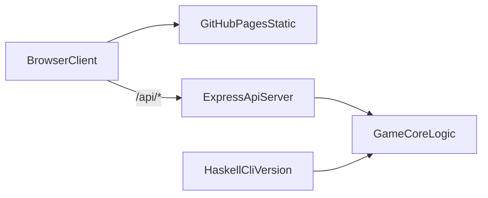

# Tree in a row


Live Demo: [https://dimkarogov.github.io/Three-in-a-row/](https://dimkarogov.github.io/Three-in-a-row/)

Проект с игрой "Три в ряд", доступной в двух версиях: консольной и браузерной.

## Содержание

- [Архитектура](#архитектура)
- [Tech Stack](#tech-stack)
- [Скриншоты](#скриншоты)
- [Консольная версия (Haskell)](#консольная-версия-haskell)
- [Сервер (TypeScript + Express)](#сервер-typescript--express)
- [Браузерная версия (HTML/CSS/JS)](#браузерная-версия-htmlcssjs)
- [Docker](#docker)
- [Deploy](#deploy)
- [CI](#ci)
- [Структура проекта](#структура-проекта)

## Архитектура



## Tech Stack

- Frontend: `HTML`, `CSS`, `Vanilla JavaScript`
- Backend: `Node.js`, `Express`, `TypeScript`
- Tests: `Vitest`
- Lint/Format: `ESLint`, `Prettier`
- CI/CD: `GitHub Actions`, `GitHub Pages`
- CLI version: `Haskell` + `Cabal`

## Скриншоты

- `docs/screenshot.png` — основной экран игры.

## Консольная версия (Haskell)

### Возможности

- Поле `6x6` с числами от `1` до `3`
- Обмен только соседних элементов
- Поиск горизонтальных и вертикальных троек
- Удаление троек и генерация новых элементов
- Подсчёт очков
- Выход из игры по команде `q`

### Требования

- [GHC](https://www.haskell.org/ghc/)
- [Cabal](https://www.haskell.org/cabal/)

### Запуск

```bash
cabal run tree-in-a-row
```

или

```bash
cabal build
cabal exec tree-in-a-row
```

## Сервер (TypeScript + Express)

### Установка и запуск

```bash
cd server
npm ci
npm run dev
```

Сервер слушает `http://localhost:3000`.

### API

- `POST /api/new-game` — создать новое поле и сбросить счёт
- `GET /api/board` — получить текущее поле и счёт (без изменения состояния)
- `POST /api/move` — выполнить ход `{ row1, col1, row2, col2 }`
- `GET /api/score` — получить текущий счёт

## Браузерная версия (HTML/CSS/JS)

1. Запустите backend (`npm run dev` в `server/`)
2. Откройте `index.html` в браузере

По умолчанию фронт ходит в `http://localhost:3000`.

Для прод-режима endpoint задаётся через `config.prod.js`:

```js
// Замените your-backend-url на URL вашего APII
window.__API_BASE__ = "https://your-backend-url.onrender.com"
```

## Docker

Сборка контейнера:

```bash
docker build -t tree-in-a-row-api ./server
```

Запуск:

```bash
docker run --rm -p 3000:3000 tree-in-a-row-api
```

Проверка:

```bash
curl http://localhost:3000/
```

## Deploy

### Frontend (GitHub Pages)

- Workflow: `.github/workflows/deploy-pages.yml`
- **Обязательно** задайте `BACKEND_API_BASE`: **Settings → Secrets and variables → Actions** — либо *Secret*, либо *Variable* (второе удобно, URL не секрет) со значением корня API, например `https://ваш-сервис.onrender.com` (без `/` в конце, без пути).
- Сборка **упадёт** без этой настройки — иначе страница на `github.io` пытается обратиться не к Render, и в игре пустое поле / ошибка загрузки.
- После push в `main` статика деплоится автоматически; при смене URL сделайте re-run workflow «Deploy Pages».

### Backend (Render)

В репозитории есть `render.yaml`.

Вариант через UI Render:
1. New Web Service -> подключить репозиторий
2. Root Directory: `server`
3. Build Command: `npm ci && npm run build`
4. Start Command: `node dist/index.js`

## CI

Workflow `.github/workflows/ci.yml` запускает:
- backend lint/build/test (Node 20 и 22)
- haskell smoke build (`cabal build`)

## Структура проекта

- `main.hs` — логика консольной версии на Haskell
- `tree-in-a-row.cabal` — конфигурация Cabal-проекта
- `index.html`, `style.css`, `game.js` — браузерный клиент
- `config.prod.js` — настройка API endpoint для production
- `server/` — backend на Node.js + TypeScript
  - `server/src/index.ts` — точка входа
  - `server/src/game.ts` — игровая логика
  - `server/src/routes.ts` — API маршруты
  - `server/src/types.ts` — типы данных
